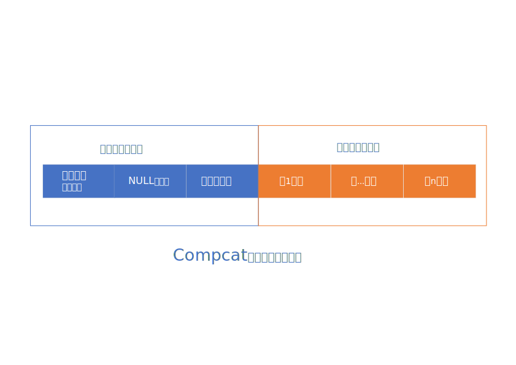
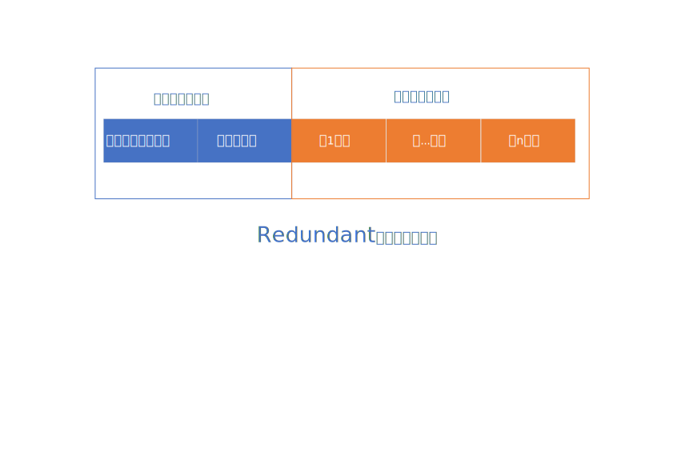

# mysql笔记

## 第一章 mysql的结构

### mysql client, mysql server, 存储引擎

1. 客户端

用户通过客户端可以和mysql server进行通信，客户端和服务器之间通信的方式包括：

- TCP/IP 

- 命名管道和共享内存（windows）

- unix域套接字文件

2. 服务器

服务器的功能包括：

- 连接管理

- 查询缓存

- 语法解析

- 查询优化

3. 存储引擎

- 表是一个逻辑概念

- mysql使用存储引擎存储表的物理机构。mysql中使用存储引擎进行数据的存储和提取，不同存储引擎管理的表的存储结构不同，存储算法不同

- 常用的存储引擎包括：

    - InnoDb：具备外键支持功能的事务存储引擎

    - myISAM：非事务处理存储引擎

    - memory: 置于内存的表 

## 第三章 字符集和比较规则

1. 字符与二进制数据

- 计算机只能存储二进制数据

- 二进制数据不可读，字符集可读。在使用过程中使用字符集，在存储的时候存储二进制数据。

2. 编码和解码

- “码”只的是二进制码，编码的意思指“编为二进制码”

- 编码：将字符映射为二进制数据

- 解码：将二进制数据映射为字符

3. 字符集

- 需要把那些字符映射成二进制数据？

- 如何映射？

- 字符集用来描述某个**字符范围**的的**编码规则**。

- utf8和utf8mb4，完整的utf8字符集需要1-4个字节进行表示，常用的utf8字符需要1-3个字节表示。在mysql中utf8是utf8mb3的别名。

4. 比较规则

如何比较两个字符的大小呢？

- 二进制比较规则，基于二进制编码进行比较

- 基于字符集制定的比较规则

## 第四章 InnoDB记录结构

在mysql中以记录为单位向表中插入数据，记录在磁盘上的存储方式被称为“记录格式”，在InnoDB存储引擎有四种记录格式：

- compact

- Redundant

- Dynamic

- Compressed

### compact记录格式

compact记录格式如下图所示：

各字段含义如下：

- 变长字段长度列表：存储记录中所有变长类型字段实际数据长度

- NULL值列表：统计表中所有可能为NULL的列，每一个NULL列对应一个二进制位，如果记录中该字段为NULL，则对应的二进制列为1，否则为0

- 记录头信息

- 真实数据记录：除了用户自定义的真实数据记录，mysql会为每一各记录默认添加一些列(row_id, t_id, roll_pointer)

### redundant记录格式

redundant记录格式如下图所示：

各字段含义说明：

- 字段长度偏移列表：记录各列数据真实值在真实数据部分的偏移量

## InnoDB索引页

页是InnoDB管理存储空间的基本单位，一般为16KB。mysql以页为单位在内存和磁盘之间读写数据。

## 第二十章 mvcc的原理

### 版本链

聚簇索引记录都会包含两个隐藏列，trx_id和roll_pointer。

- trx_id：一个事务每次对某条聚簇索引记录进行改动，都会把该事务的事务ID赋值给trx_id隐藏列

- roll_pointer：每次对聚簇索引记录进行修改时，都会把旧版本写入到undo日志中。通过roll_pointer指向该undo日志。

每次对记录进行修改都会记录一条undo日志。每条undo日志也都有一个roll_pointer指向上一个undo日志。通过undo日志穿成链表，构成版本链。

undo日志只记录被修改列的信息，如果没有一个列的修改信息，则该列在本次事务中未修改，和上一个undo日志中的结果保持一致。

### readView

readView解决的核心问题：版本链中的哪个版本是当前事务可见的？

- m_ids：当前系统中活跃的读写事务的事务ID列表

- min_trx_id：生成readView时，当前系统中活跃的读写事务中最小的事务Id

- max_trx_id：生成readview时，系统应该分配给下一个事务的事务Id值

- creator_trx_id：生成该readView的事务的事务Id

按照如下步骤判断记录的某个版本是否可见：

- 如果被访问版本的trx_id = creator_trx_id，则当前事务访问自己的记录

- 如果被访问版本的trx_id属性值小于min_trx_id，表示该版本已提交，事务可以访问

- 如果被访问版本的trx_id属性值大于或者等于max_trx_id，表示该版本在当前事务生成后才开启，不能访问

- 如果被访问版本的trx_id在min_trx_id和max_trx_id之间，则需要判断trx_id是否在m_ids列表中。如果在，说明该版本还是活跃的，不能访问。如果不再，说明事务已经提交，该版本可以访问。

如果该记录对当前事务不可见，则顺着版本链找到下一个版本，并继续执行上述步骤来判断可见性。依次类推，直到找到可见的版本。如果都不可见，则该记录对本事务不可见。

